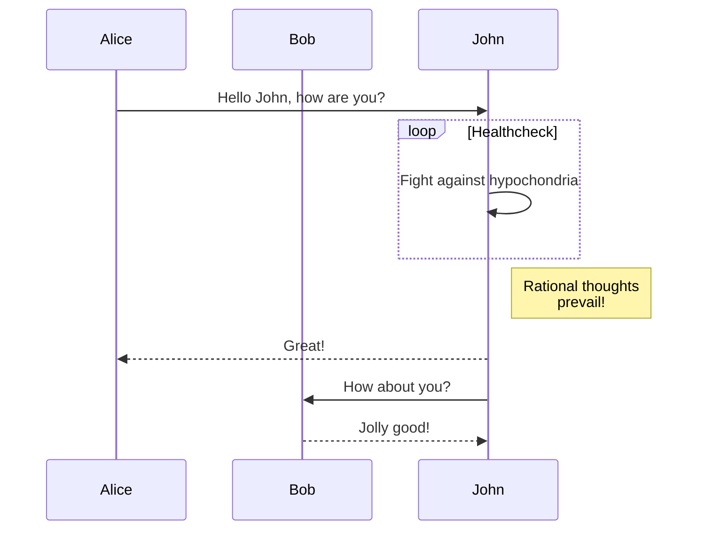
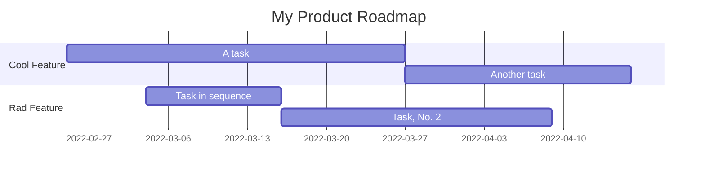

## Mermaid

```mermaid
sequenceDiagram
    participant Alice
    participant Bob
    Alice->>John: Hello John, how are you?
    loop Healthcheck
        John->>John: Fight against hypochondria
    end
    Note right of John: Rational thoughts <br/>prevail!
    John-->>Alice: Great!
    John->>Bob: How about you?
    Bob-->>John: Jolly good!
```

```mermaid
gantt
    title My Product Roadmap
    dateFormat  YYYY-MM-DD
    section Cool Feature
    A task           :a1, 2022-02-25, 30d
    Another task     :after a1, 20d
    section Rad Feature
    Task in sequence :2022-03-04, 12d
    Task, No. 2      :24d
```
